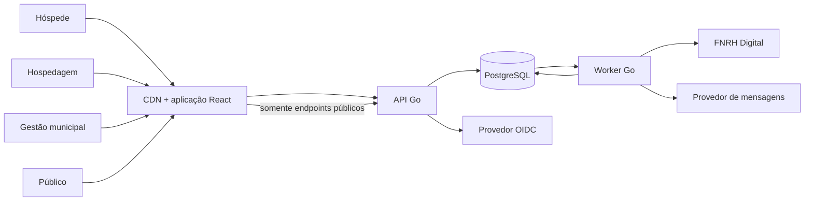
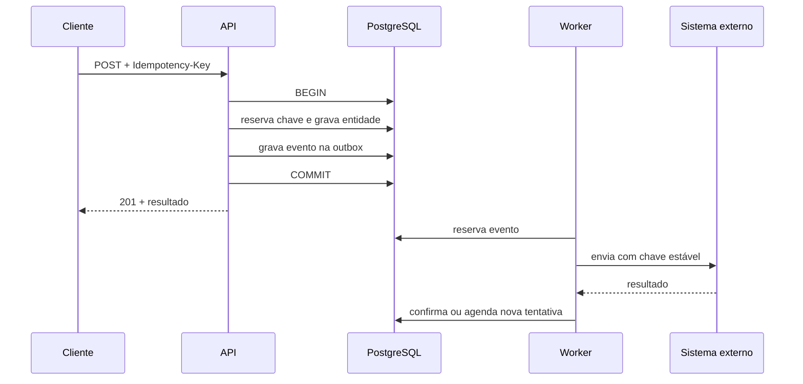

# Arquitetura

## Estilo

Monólito modular com processos separados de API e worker, compilados a partir do
mesmo módulo Go. O front-end é uma SPA React distribuída estaticamente.



## Unidades implantáveis

1. `api`: endpoints públicos e autenticados.
2. `worker`: outbox, agregação, integração e manutenção.
3. `web`: arquivos estáticos.
4. `postgres`: serviço gerenciado, alta disponibilidade em produção.

O worker pode ter várias réplicas porque reserva jobs usando
`FOR UPDATE SKIP LOCKED`. Não existe líder único.

## Módulos do backend

| Módulo | Responsabilidade |
|---|---|
| `access` | identidade OIDC, escopos e autorização |
| `accommodation` | organizações, imóveis e operadores |
| `stay` | estadias, grupos, visitantes, presença |
| `questionnaire` | versões, perguntas, regras e respostas |
| `analytics` | agregados internos, métricas públicas e previsão |
| `privacy` | classificação, retenção e direitos do titular |
| `audit` | eventos administrativos invioláveis pela aplicação |
| `fnrh` | adaptador versionado e reconciliação |
| `platform` | HTTP, banco, configuração, telemetria e jobs |

Um módulo não acessa diretamente tabelas privadas de outro módulo. A primeira
implementação pode manter todos no mesmo banco, mas deve respeitar interfaces e
pacotes.

## Banco e esquemas

```text
identity   dados diretamente identificáveis e credenciais cifradas
core       acomodações, estadias e dados generalizados
survey     questionários, versões e respostas
analytics  fatos pseudonimizados e agregados internos
public     métricas já protegidas e liberadas
platform   idempotência, outbox, jobs e auditoria
```

Papéis distintos:

- `app_runtime`: lê/escreve `core`, `survey`, `platform`; acesso restrito a
  `identity`;
- `worker_runtime`: processa jobs e gera agregados;
- `public_runtime`: somente leitura no esquema `public_data`;
- `migration_admin`: usado apenas na implantação;
- `privacy_officer`: acesso temporário, auditado e justificado.

## Fluxo de escrita



## Front-end

Uma aplicação React com três áreas carregadas sob demanda:

- pública: dashboard e metodologia;
- registro: estadia, integrantes e pesquisa;
- autenticada: hospedagens, administração e privacidade.

Não há ganho suficiente em manter três projetos separados no MVP. As fronteiras
continuam no roteamento, nos bundles e na autorização da API.

## Escalabilidade

Escalar nesta ordem:

1. CDN e cache dos endpoints públicos.
2. Réplicas horizontais da API.
3. Réplicas horizontais do worker.
4. Índices e agregados incrementais.
5. Réplica de leitura do PostgreSQL para análises internas.
6. Separação física do banco analítico somente quando métricas demonstrarem
   contenção real.

Não começar com microsserviços, data lake ou streaming distribuído.

## Decisões

- Go pela previsibilidade operacional, binário único e boa concorrência.
- React pela maturidade do ecossistema de formulários, acessibilidade e gráficos.
- Vite porque o front é predominantemente cliente e não depende de SSR.
- PostgreSQL como fila para manter atomicidade e reduzir infraestrutura.
- OpenAPI como contrato entre front, testes e integrações.
- OIDC para não armazenar senhas nem implementar MFA.
