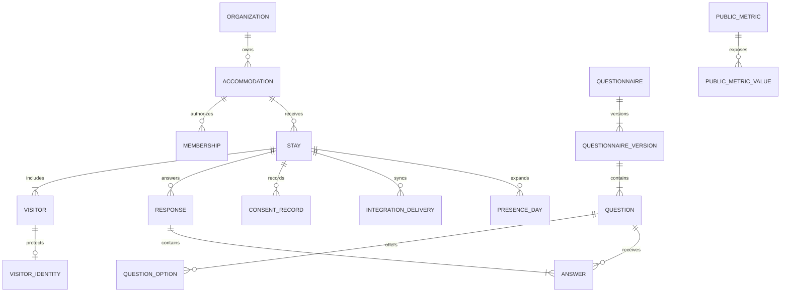

# Modelo de dados

## Diagrama conceitual

## Identidade

Dados diretamente identificáveis ficam em `identity.visitor_identity`:

- nome cifrado;
- documento cifrado quando a finalidade exigir;
- e-mail/telefone cifrados quando necessários;
- hashes cegos com chave para deduplicação;
- versão da chave de criptografia.

O restante da aplicação usa `visitor_id`, que não possui significado externo.
Hash simples de CPF não é aceitável; use HMAC com chave rotacionável e separada.

## Dados generalizados

`core.visitor` pode conter:

- faixa etária;
- UF e código IBGE do município de origem;
- país de residência;
- papel no grupo;
- atributos necessários à contagem.

Não grave endereço residencial. Idade exata deve ser derivada em faixa e
descartada sempre que a finalidade permitir.

## Datas

- `planned_arrival_on` e `planned_departure_on`: `date`, na zona civil de
  Cumuruxatiba.
- `checked_in_at` e `checked_out_at`: `timestamptz`, sempre UTC.
- Relatórios convertem usando `America/Bahia`.
- O intervalo de presença é `[entrada, saída)`: a pessoa presente de 10 a 12
  conta nos dias 10 e 11, não no dia 12 depois do check-out padrão.

## Deduplicação

Camadas:

1. `client_submission_id` único por envio.
2. Chave idempotente por endpoint e ator.
3. Restrição de negócio por acomodação + referência externa.
4. HMAC de documento, quando legalmente coletado.
5. Alertas probabilísticos internos para nome normalizado + período, sem fusão
   automática.

Nunca tente deduplicar publicamente por nome, idade e cidade.

## Questionários e respostas

`questionnaire_version` é imutável depois de publicado. `question` contém:

- `stable_key`: nome lógico estável;
- `prompt`;
- `type`;
- `required`;
- `data_classification`;
- `purpose_code`;
- `analytics_key`;
- `public_aggregation_allowed`;
- `validation`;
- `visibility_rule`;
- `display_order`.

Respostas estruturadas ficam em colunas tipadas ou JSONB validado pela
aplicação. Texto livre fica cifrado ou em tabela de acesso restrito e não entra
em agregados sem classificação manual.

## Presença

O worker materializa `analytics.presence_day` por visitante e dia para cálculos
internos. Esta tabela é pseudonimizada e nunca exposta ao papel público.

Alterações em chegada, saída, cancelamento ou quantidade geram reprocessamento
do período afetado, usando `UPSERT` determinístico.

## Agregados públicos

`public.metric_value` contém somente:

- código da métrica;
- período permitido;
- dimensões permitidas e generalizadas;
- valor já arredondado ou faixa;
- tamanho da amostra;
- cobertura estimada;
- versão da política de privacidade;
- horário de publicação.

Não contém `visitor_id`, `stay_id`, texto livre, estabelecimento ou identificador
de operador.

## Contexto externo

O schema `external` guarda dado copiado de terceiro — clima hoje, maré quando o
direito de publicar existir. É **sumidouro, nunca insumo**: não entra em
`analytics`, em `public_data.metric_cells`, no forecast nem na cobertura
(ADR-045 §1).

A separação não é convenção de código, é ACL do PostgreSQL:

- `external_runtime` escreve em `external` e não recebe `SELECT` em `core`,
  `survey`, `analytics` nem `public_data`;
- `worker_runtime`, que reconcilia presença, cobertura e forecast, não recebe
  **nenhum** privilégio em `external`, nem `USAGE`;
- os dois papéis convivem no mesmo processo do worker, em pools distintos: o
  egresso sai só do worker, e o privilégio de escrita é que separa as camadas;
- nenhuma chave estrangeira atravessa a fronteira, nos dois sentidos.

Seis relações:

| Relação | Papel |
| --- | --- |
| `external.sources` | o publicador: licença, `attribution_text` que vai ao público como está, `terms_url`, `commercial_use_allowed` |
| `external.series` | unidade, período, retenção, `public_exposable` e `data_mode`; unidade e período moram aqui, nunca na observação |
| `external.observations` | o fato, com `revision` gravada; digest igual é no-op, digest diferente é revisão nova |
| `external.fetch_runs` | torna "indisponível" distinguível de "não rodou"; o card lê o `outcome` da última run |
| `external.tide_stations` / `external.tide_harmonics` | importação curada do CHM, fora do caminho do worker |

O `outcome` de `external.fetch_runs` é vocabulário fechado por CHECK:

| `outcome` | Significa |
| --- | --- |
| `ok` | coleta bem-sucedida, com observação gravada |
| `unchanged` | a fonte respondeu, e o digest era igual ao já gravado |
| `http_error` | a fonte não respondeu, ou respondeu erro |
| `parse_error` | a fonte respondeu, e o corpo não casou com o formato esperado |
| `write_error` | a fonte respondeu e foi lida, e a gravação falhou |
| `rate_limited` | a fonte recusou por limite de uso |
| `skipped_budget` | o ciclo acabou antes desta fonte, por orçamento de lote |

`write_error` existe separado de `http_error` porque a causa precisa ser
nomeável: registrar falha de banco como erro de rede faria quem depura procurar
no lugar errado, e é justamente a distinção de causa que dá utilidade à tabela.

Mudar a unidade de uma série é `series_code` novo, nunca `ALTER` in-place: a
observação antiga passaria a mentir sobre a própria unidade.

A leitura pública sai de **duas** views em `public_data`:
`current_external_context`, com os cards, e `current_external_sources`, com os
créditos das fontes ativas. As duas leem `external` sob os privilégios do dono,
então o papel público continua sem qualquer privilégio e sem `USAGE` no schema
`external`, e o `search_path` do pool público não muda.

Os créditos moram em view separada, e não como mais uma linha da primeira,
porque o Cadastur é creditado **sem card**: não existe linha com forma de card
onde ele caiba, e forçá-lo lá exigiria inventar um card sem valor. Nenhuma
consulta do caminho público lê tabela base de `external` — se lesse, falharia
com `permission denied for schema external`, e é isso que a asserção de
paridade em `deploy/scripts/test-migrations.sh` verifica, executando cada
relação da rota como `public_runtime`.

Série que descreva estabelecimentos nominalmente tem `public_exposable = false`,
com CHECK e ACL. O Cadastur é o caso declarado: entra como fonte creditada e
link, **sem nenhuma contagem calculada pela plataforma**. Publicar o universo
`N` ao lado da cobertura entregaria `não_reportantes ≈ N − round(r×N)`, que numa
vila com conjunto enumerável de pousadas individualiza quem não reporta.

Retenção é por série (`retention_days`) e varrida em lote limitado: resposta
bruta de terceiro é cache com prazo, não acervo, e a decisão aqui é de custo e
de licença, não de privacidade.

## Auditoria

`platform.audit_event` é append-only e guarda:

- ator pseudônimo ou técnico;
- ação;
- tipo e ID da entidade;
- justificativa;
- campos alterados, sem valor pessoal;
- IP truncado ou HMAC, conforme política;
- correlação e timestamp.

Bloqueie `UPDATE` e `DELETE` para o papel da aplicação.

## Retenção

Cada classe de dados possui política versionada. Um job:

1. identifica registros vencidos;
2. verifica `legal_hold`;
3. apaga ou anonimiza identidade;
4. preserva apenas o agregado permitido;
5. grava comprovante de execução sem copiar o conteúdo apagado.

Prazos definitivos são decisão jurídica, não constante técnica.
