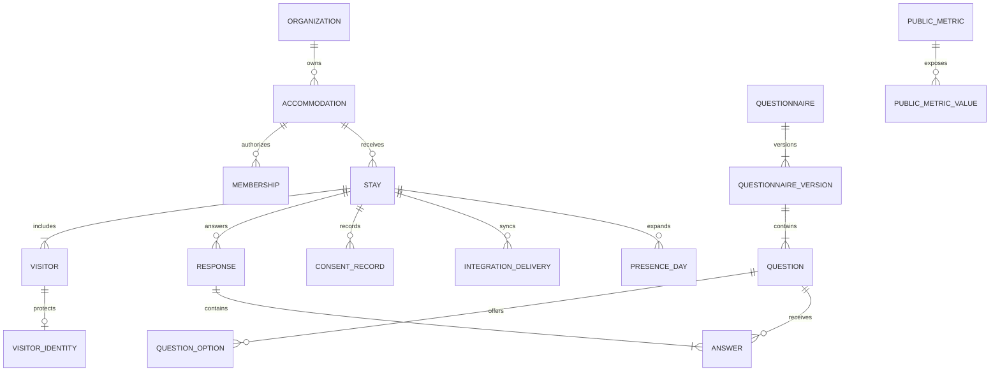

# Modelo de dados

## Diagrama conceitual

## Identidade

Dados diretamente identificáveis ficam em `identity.visitor_identity`:

- nome cifrado;
- documento cifrado quando a finalidade exigir;
- e-mail/telefone cifrados quando necessários;
- hashes cegos com chave para deduplicação;
- versão da chave de criptografia.

O restante da aplicação usa `visitor_id`, que não possui significado externo.
Hash simples de CPF não é aceitável; use HMAC com chave rotacionável e separada.

## Dados generalizados

`core.visitor` pode conter:

- faixa etária;
- UF e código IBGE do município de origem;
- país de residência;
- papel no grupo;
- atributos necessários à contagem.

Não grave endereço residencial. Idade exata deve ser derivada em faixa e
descartada sempre que a finalidade permitir.

## Datas

- `planned_arrival_on` e `planned_departure_on`: `date`, na zona civil de
  Cumuruxatiba.
- `checked_in_at` e `checked_out_at`: `timestamptz`, sempre UTC.
- Relatórios convertem usando `America/Bahia`.
- O intervalo de presença é `[entrada, saída)`: a pessoa presente de 10 a 12
  conta nos dias 10 e 11, não no dia 12 depois do check-out padrão.

## Deduplicação

Camadas:

1. `client_submission_id` único por envio.
2. Chave idempotente por endpoint e ator.
3. Restrição de negócio por acomodação + referência externa.
4. HMAC de documento, quando legalmente coletado.
5. Alertas probabilísticos internos para nome normalizado + período, sem fusão
   automática.

Nunca tente deduplicar publicamente por nome, idade e cidade.

## Questionários e respostas

`questionnaire_version` é imutável depois de publicado. `question` contém:

- `stable_key`: nome lógico estável;
- `prompt`;
- `type`;
- `required`;
- `data_classification`;
- `purpose_code`;
- `analytics_key`;
- `public_aggregation_allowed`;
- `validation`;
- `visibility_rule`;
- `display_order`.

Respostas estruturadas ficam em colunas tipadas ou JSONB validado pela
aplicação. Texto livre fica cifrado ou em tabela de acesso restrito e não entra
em agregados sem classificação manual.

## Presença

O worker materializa `analytics.presence_day` por visitante e dia para cálculos
internos. Esta tabela é pseudonimizada e nunca exposta ao papel público.

Alterações em chegada, saída, cancelamento ou quantidade geram reprocessamento
do período afetado, usando `UPSERT` determinístico.

## Agregados públicos

`public.metric_value` contém somente:

- código da métrica;
- período permitido;
- dimensões permitidas e generalizadas;
- valor já arredondado ou faixa;
- tamanho da amostra;
- cobertura estimada;
- versão da política de privacidade;
- horário de publicação.

Não contém `visitor_id`, `stay_id`, texto livre, estabelecimento ou identificador
de operador.

## Auditoria

`platform.audit_event` é append-only e guarda:

- ator pseudônimo ou técnico;
- ação;
- tipo e ID da entidade;
- justificativa;
- campos alterados, sem valor pessoal;
- IP truncado ou HMAC, conforme política;
- correlação e timestamp.

Bloqueie `UPDATE` e `DELETE` para o papel da aplicação.

## Retenção

Cada classe de dados possui política versionada. Um job:

1. identifica registros vencidos;
2. verifica `legal_hold`;
3. apaga ou anonimiza identidade;
4. preserva apenas o agregado permitido;
5. grava comprovante de execução sem copiar o conteúdo apagado.

Prazos definitivos são decisão jurídica, não constante técnica.
