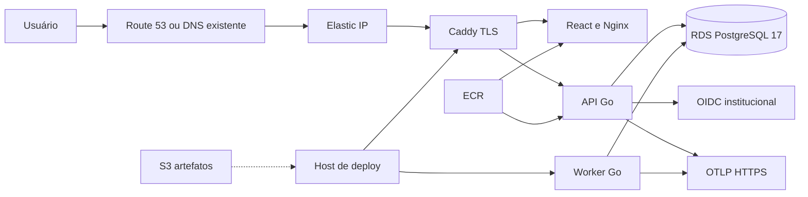

# Infraestrutura e deploy

## Resultado da análise

A referência escolhida é AWS São Paulo (`sa-east-1`) com uma instância ARM
pequena e PostgreSQL 17 gerenciado. Ela não é a menor fatura absoluta, mas é a
opção mais barata entre as comparadas que preserva simultaneamente região no
Brasil, PostgreSQL 17, TLS, banco privado, backup/PITR, KMS, secret manager e
um caminho institucional previsível.

O detalhamento de preço, alternativas e limites está no
[`ADR-031`](decisoes/ADR-031-infraestrutura-economica-aws-sao-paulo.md).

## Topologia econômica



O RDS não possui IP público. API, worker e web compartilham uma VM somente no
baseline econômico. A aplicação pode evoluir para duas instâncias e
load balancer sem alterar o banco.

## Superfícies entregues

```text
deploy/
├── ansible/                 configuração e deploy idempotente da VM
├── compose.production.yaml runtime externo sem PostgreSQL local
├── observability/           Prometheus, Tempo, Grafana e OTel locais
├── terraform/
│   ├── aws/                 VPC, EC2, RDS, ECR, S3, KMS e alertas
│   └── bootstrap-state/     bucket/KMS para state remoto
└── scripts/                 build/push, inventory e validações
```

## Fluxo seguro

1. Criar o backend remoto de state.
2. Inicializar e revisar o plano Terraform.
3. Aplicar a infraestrutura somente após aprovação humana.
4. Publicar imagens ARM no ECR e registrar os dois digests retornados.
5. Gerar o inventory a partir dos outputs Terraform.
6. Informar tag e digests da API/web e executar o Ansible com domínio, OIDC e
   OTLP reais.
7. Validar health, readiness, TLS, migrations e logs.
8. Executar e documentar restore antes de qualquer piloto.

Os READMEs em `deploy/terraform/` e `deploy/ansible/` contêm comandos e
pré-requisitos exatos.

## Ambiente local completo

O Compose base continua rápido para desenvolvimento:

```bash
make up
make smoke
```

O overlay de infraestrutura adiciona traces e métricas locais:

```bash
deploy/scripts/local-infra.sh up
deploy/scripts/local-infra.sh smoke
deploy/scripts/local-infra.sh down
```

Serviços locais:

- aplicação em `http://127.0.0.1:4173`;
- Grafana em `http://127.0.0.1:3000`;
- Prometheus em `http://127.0.0.1:9092`;
- Tempo em `http://127.0.0.1:3200`;
- PostgreSQL em `127.0.0.1:5433`, ajustável por `POSTGRES_HOST_PORT`.

Todos usam fixtures públicas de `local|test`. O fake OIDC continua local porque
o frontend ainda não possui jornada institucional de login. O overlay não
simula que OIDC, KMS, WAF, CDN ou backup de produção foram aprovados.

Imagens de terceiros em Dockerfiles, Compose e validações são fixadas por
`tag@sha256`. Em produção, `cumuru_api_image_digest` e
`cumuru_web_image_digest` são obrigatórios e o Ansible forma referências
`repositório:tag@sha256`; mover uma tag não altera o conteúdo implantado. A
política e a distinção entre digest local e digest do registry estão no
[`ADR-033`](decisoes/ADR-033-identidade-imutavel-de-imagens-oci.md).
O gate obrigatório `make infra-validation`, executado também pelo workflow,
rejeita referência mutável em Dockerfiles, Compose, Ansible e no teste de
proxy. A fixture de proveniência também rejeita `RepoDigest` de outro
repositório ou com digest diferente.

## Estado atual dos gates

| Gate | Estado |
| --- | --- |
| Terraform/Ansible/Compose local | verificável offline/local |
| PostgreSQL 17 gerenciado real | `UNVERIFIED` até `terraform apply` |
| TLS e DNS públicos | `UNVERIFIED` até deploy autorizado |
| OIDC institucional | `BLOCKED` por seleção/governança |
| OTLP externo | `UNVERIFIED` |
| backup e restore | `UNVERIFIED` até teste real |
| `questionnaire` e `analytics` fora de `local|test` | `BLOCKED` pela configuração atual |
| dados reais/piloto/release | `BLOCKED` pelos gates externos |
